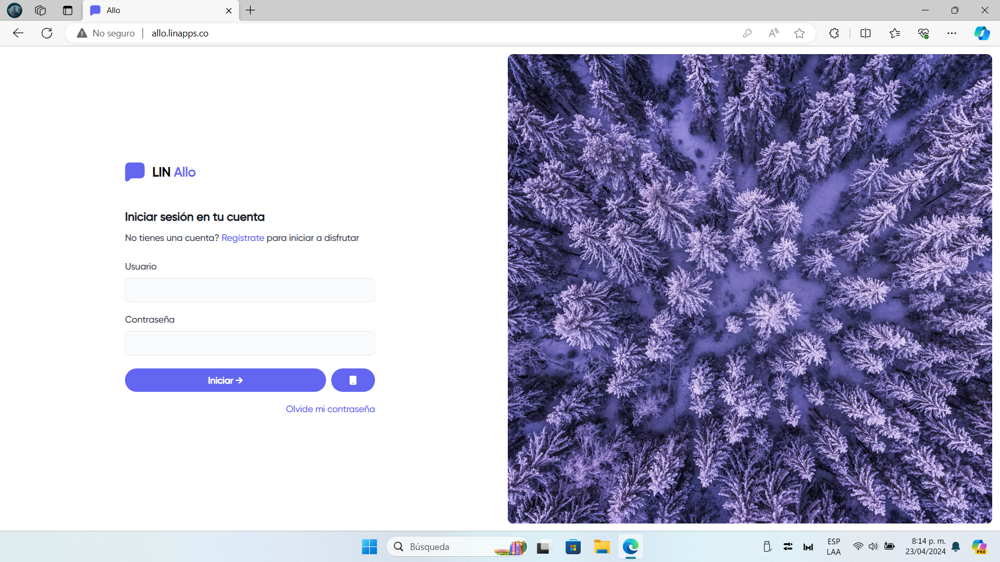
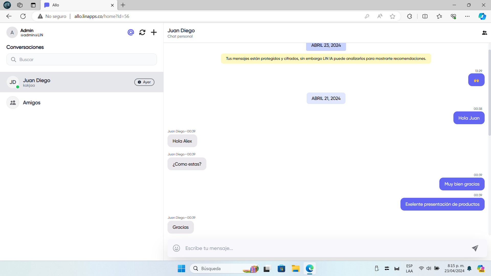

  

    
  

  
Esta es una aplicación de chat en tiempo real desarrollada con Blazor, LIN Auth para la autenticación, LIN Communication Services como servidor en tiempo real y LIN Maps para la integración de mapas. La aplicación permite a los usuarios enviar mensajes, crear grupos, enviar imágenes, ubicaciones y mapas.

 

    
    
  

## Características principales

- Autenticación de usuarios utilizando LIN Auth.
- Chat en tiempo real utilizando LIN Communication Services.
- Posibilidad de crear grupos de chat.
- Envío de mensajes de texto en tiempo real.
- Envío de imágenes (En desarrollo)
- Compartir ubicación y mostrar mapas utilizando LIN Maps (En desarrollo).

## Requisitos previos

Asegúrate de tener instalado lo siguiente:

- .NET 8 SDK
- Servidores de LIN Auth y Communication y tipos asociados.

[Pagina Principal](http://allo.linapps.co/)